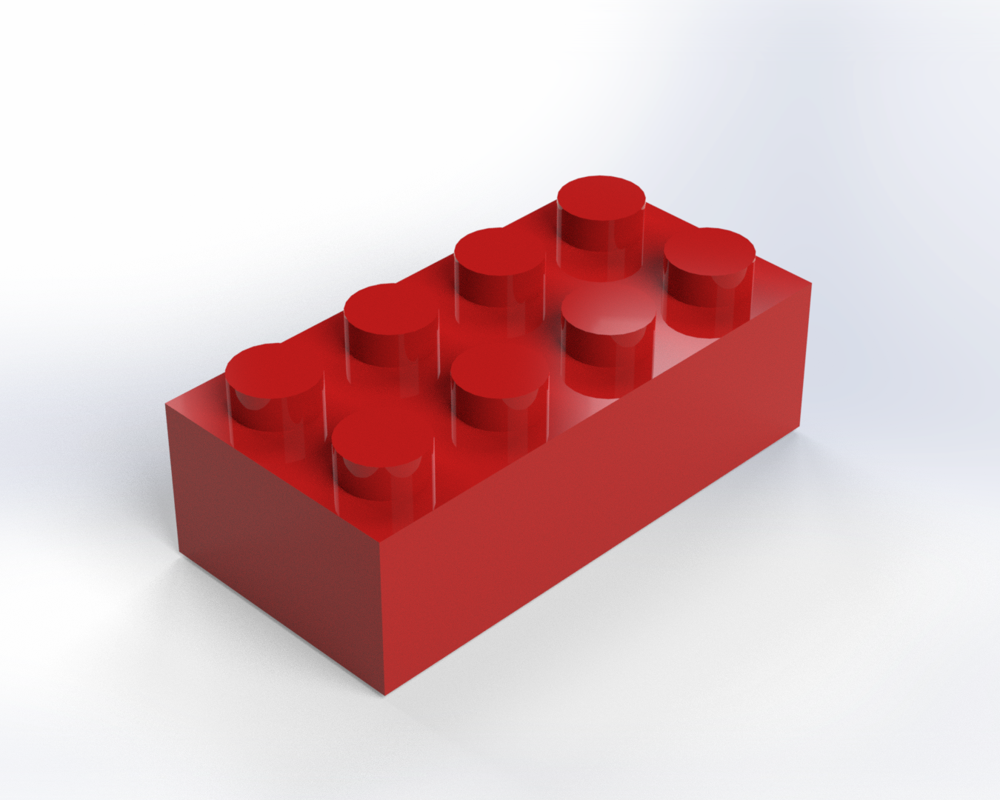
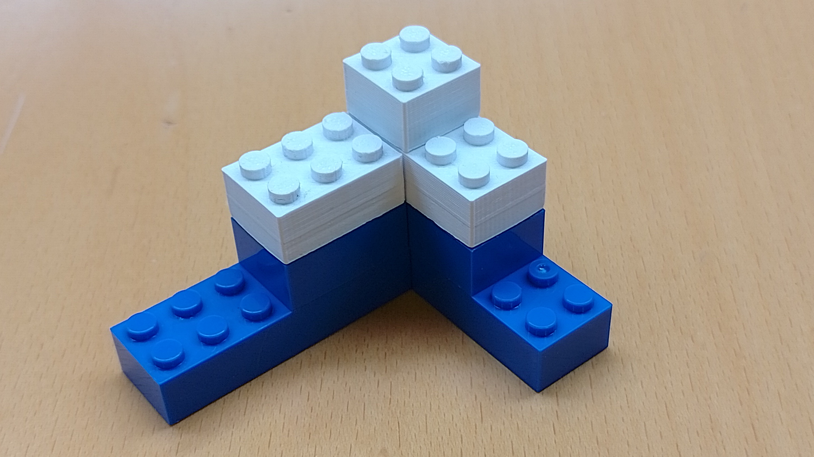

# 3D-Printable Blocks


## Introduction

Welcome to my repository for my 3D-Printable Blocks project.

<div>
    
    
</div>

## Motivation

I started this project because after evaluating my LORE robot (see [here](https://github.com/drfknoble/lore)), I realised it took a long time to assemble it.

Subsequently, I thought about different ways to assemble it and thought: "why don't I build it out of blocks?". 

So, I designed a series of blocks that could 3D-printed and used in other projects, e.g., LORE.

## Aims

The aims of this project included:
- Developing 3D-printable blocks that were compatible with other commercially-available blocks.

## Objectives

The objectives of this project included:
- Creating accessible Computer Aided Design (CAD) files.
- Building an object using the 3D-printed blocks.

## Repository Structure

The repository is organised as follows:

```console
/blocks         
    /cad                          
        /solidworks                    
        /freecad  
        /fabrication
        /renders      
    /doc               
```

All CAD files can be found in the `/cad` sub-directory. I've included the original SOLIDWORKS files and the open-source equivalents.

All documentation files can be found in the `/doc` sub-directory. I've a spreadsheet which I used to calculate block sizes and centrepoint locations.

## Tools Used

I used the following tools in this project:
- SOLIDWORKS and FreeCAD.

Get FreeCAD here: https://www.freecadweb.org/.  

## Credit

Dr Frazer K. Noble  
http://drfknoble.com
